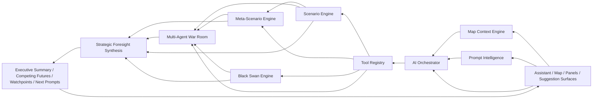

# AI Strategic Foresight System

## Scope
This document consolidates the phased implementation of the QADR110 AI Strategic Foresight System. It maps each phase to concrete source files, runtime flow, UI surfaces, and test coverage.

The implementation preserves the existing QADR110 architecture:

- Tauri 2 desktop runtime
- Preact + Vite web shell
- panel-based modular workspace
- shared web/Tauri parity where practical
- explainable, evidence-aware, map-aware analysis

## System Diagram



## End-to-End Flow

```text
User question or map selection
-> map/session/signal context capture
-> prompt rewrite + model routing
-> tool plan
-> scenario generation
-> meta-scenario fusion/conflict analysis
-> black swan stress test
-> optional war room debate
-> strategic foresight synthesis
-> board-ready output + follow-up prompts + map-linked surfaces
```

## Phase 1: Orchestrator Foundation

### Goal
Build a local-first, tool-aware, session-aware orchestration layer with model routing and prompt rewriting.

### Core Files
- `src/services/ai-orchestrator/gateway.ts`
- `src/services/ai-orchestrator/orchestrator.ts`
- `src/services/ai-orchestrator/prompt-strategy.ts`
- `src/services/ai-orchestrator/session.ts`
- `src/services/ai-orchestrator/index.ts`
- `src/platform/ai/orchestrator-contracts.ts`
- `server/worldmonitor/intelligence/v1/orchestrator.ts`
- `server/worldmonitor/intelligence/v1/orchestrator-tools.ts`
- `server/_shared/llm.ts`
- `src/services/intelligence-assistant.ts`
- `docs/qadr/local-first-ai-orchestrator.md`

### Delivered Capabilities
- multi-model routing:
  - local models as default
  - OpenRouter as escalation/fallback
- tool calling contracts
- session memory
- prompt rewriting
- tool execution trace
- structured output merge/fallback

### Phase Patch Summary
- Added orchestrator contracts and registry-driven tools.
- Added routing policies for fast, reasoning, structured JSON, and cloud escalation paths.
- Added session memory for intent history, reusable insights, and map interactions.
- Added prompt composition rules that inject map context, recent signals, and evidence packets.

### Tests
- `tests/ai-orchestrator-routing.test.mts`
- `tests/ai-orchestrator-runner.test.mts`
- `tests/ai-orchestrator-session.test.mts`

## Phase 2: Scenario Engine

### Goal
Answer: if X happens, what happens next.

### Core Files
- `src/ai/scenario-engine.ts`
- `src/ai/scenario-decision-support.ts`
- `docs/qadr/scenario-engine.md`

### Delivered Capabilities
- structured scenario generation
- causal chain reasoning
- scenario ranking
- drivers and indicators
- mitigation and monitoring suggestions
- decision-support overlays for each scenario

### Output Shape
- scenarios with:
  - description
  - probability
  - impact level
  - time horizon
  - drivers
  - causal chain
  - indicators to watch
  - mitigation options

### Phase Patch Summary
- Added canonical scenario engine with explainable heuristics.
- Added scenario decision-support layer for actions, trade-offs, leverage points, and uncertainties.

### Tests
- `tests/scenario-engine.test.mts`
- `tests/scenario-simulation.test.mts`
- `tests/scenario-suggestion-engine.test.mts`

## Phase 3: Meta-Scenario Engine

### Goal
Combine scenarios, detect interaction, and model conflicts between futures.

### Core Files
- `src/ai/meta-scenario-engine.ts`
- `src/ai/scenario-graph.ts`
- `src/ai/meta-scenario-suggestions.ts`
- `docs/qadr/meta-scenario-engine.md`

### Delivered Capabilities
- scenario fusion
- dependency and contradiction detection
- scenario conflict and scenario war modeling
- graph-oriented representation of interacting futures
- higher-order prompt suggestions for fusion, conflict, uncertainty, and strategy

### Phase Patch Summary
- Added meta-scenario synthesis on top of base scenarios.
- Added graph model for amplification, suppression, contradiction, dependency, and convergence edges.
- Added scenario war simulation that redistributes explanatory dominance as signals change.

### Tests
- `tests/meta-scenario-engine.test.mts`
- `tests/scenario-graph.test.mts`
- `tests/meta-scenario-suggestions.test.mts`

## Phase 4: Black Swan Detection

### Goal
Detect low-probability, high-impact futures that break dominant assumptions.

### Core Files
- `src/ai/black-swan-engine.ts`
- `src/services/black-swan-intelligence.ts`
- `src/platform/operations/black-swan-intelligence.ts`
- `src/components/BlackSwanPanel.ts`
- `docs/qadr/black-swan-engine.md`

### Delivered Capabilities
- weak signal analysis
- assumption stress tests
- structural break detection
- watchlist of black swan indicators
- continuous severity updates as signals evolve

### Phase Patch Summary
- Added explicit black swan candidate scoring.
- Added monitoring layer and panel surface for analyst inspection.
- Connected black swan outputs into meta-scenario and assistant flows.

### Tests
- `tests/black-swan-engine.test.mts`

## Phase 5: Multi-Agent War Room

### Goal
Create a multi-agent strategic deliberation room with explicit debate rounds and synthesis.

### Core Files
- `src/ai/war-room/agents.ts`
- `src/ai/war-room/prompt-registry.ts`
- `src/ai/war-room/debate-state.ts`
- `src/ai/war-room/debate-engine.ts`
- `src/ai/war-room/scenario-integration.ts`
- `src/ai/war-room/index.ts`
- `src/components/WarRoomPanel.ts`
- `src/components/war-room-ui.ts`
- `docs/qadr/war-room-prompt-registry.md`
- `docs/qadr/war-room-debate-engine.md`

### Delivered Capabilities
- agent roles:
  - Strategic Analyst
  - Red Team Skeptic
  - Economic Analyst
  - OSINT Analyst
  - Cyber / Infrastructure Analyst
  - Social Sentiment Analyst
  - Scenario Moderator
  - Executive Synthesizer
- debate rounds:
  - assessment
  - critique
  - revision
  - synthesis
- disagreement matrix
- replayable debate trace
- scenario-aware debate outputs

### Phase Patch Summary
- Added reusable prompt registry per role and stage.
- Added debate state machine with configurable rounds and agent inclusion.
- Added War Room UI with agent cards, rounds, heatmap, and executive synthesis.
- Added integration layer so agents can inspect active scenarios, meta-scenarios, and black swans.

### Tests
- `tests/war-room-prompts.test.mts`
- `tests/war-room-debate-state.test.mts`
- `tests/war-room-engine.test.mts`
- `tests/war-room-scenario-integration.test.mts`
- `tests/war-room-ui.test.mts`

## Phase 6: Prompt Intelligence Layer

### Goal
Generate dynamic prompt suggestions from context rather than static menus.

### Core Files
- `src/services/PromptSuggestionEngine.ts`
- `src/services/ScenarioSuggestionEngine.ts`
- `src/ai/meta-scenario-suggestions.ts`
- `src/platform/operations/prompt-intelligence.ts`
- `src/components/QadrAssistantPanel.ts`

### Delivered Capabilities
- context-aware prompt suggestions
- scenario-specific suggestions
- meta-scenario and black swan prompts
- explanation for why each prompt matters
- impact-aware prompt cards

### Phase Patch Summary
- Added floating suggestion logic for assistant and scenario workspaces.
- Added grouped suggestions for OSINT, forecast, risk, strategy, deep analysis, fusion, conflict, black swan, and uncertainty.

### Tests
- `tests/prompt-suggestion-engine.test.mts`
- `tests/scenario-suggestion-engine.test.mts`
- `tests/meta-scenario-suggestions.test.mts`

## Phase 7: Map Integration

### Goal
Make AI requests and foresight flows fully geo-aware.

### Core Files
- `src/services/MapAwareAiBridge.ts`
- `src/services/map-aware-ai-utils.ts`
- `src/services/map-analysis-workspace.ts`
- `src/services/ScenarioMapOverlay.ts`
- `src/platform/operations/map-context.ts`
- `src/platform/operations/map-aware-ai.ts`
- `src/components/MapContainer.ts`
- `src/components/Map.ts`
- `src/components/DeckGLMap.ts`
- `src/components/GlobeMap.ts`
- `src/components/map-interactions.ts`
- `docs/qadr/map-geo-analytic-workspace.md`

### Delivered Capabilities
- lat/lon, zoom, bbox capture
- nearby signals and local evidence packets
- map-aware prompt injection
- localized region simulation and forecast commands
- scenario overlays, hotspots, and impact zones

### Phase Patch Summary
- Added canonical map interaction payloads.
- Added map-aware bridge from map selection to assistant/orchestrator.
- Added scenario overlays and commands for simulation, escalation forecast, and anomaly detection.

### Tests
- `tests/map-aware-ai.test.mts`
- `tests/scenario-map-overlay.test.mts`

## Phase 8: Strategic Foresight Mode

### Goal
Combine orchestrator, scenario, meta-scenario, black swan, war room, prompt intelligence, and map context into one strategic workspace.

### Core Files
- `src/ai/strategic-foresight.ts`
- `src/components/StrategicForesightPanel.ts`
- `src/components/qadr-assistant-ui.ts`
- `src/platform/ai/assistant-contracts.ts`
- `src/platform/ai/assistant-schema.ts`
- `src/services/PromptSuggestionEngine.ts`
- `src/services/MapAwareAiBridge.ts`
- `src/app/panel-layout.ts`
- `src/config/panels.ts`
- `docs/qadr/strategic-foresight-mode.md`

### Delivered Capabilities
- integrated foresight synthesis
- board-ready executive summaries
- dominant scenarios
- competing futures
- black swan candidates
- debate highlights
- watch indicators
- recommended next prompts

### Phase Patch Summary
- Added strategic foresight synthesis layer on top of existing modules.
- Added orchestrator tool `strategic_foresight`.
- Added dedicated panel and assistant mode for foresight work.
- Added map entry point and suggestion entry point into foresight mode.

### Tests
- `tests/strategic-foresight.test.mts`

## Cross-Cutting UI Surfaces

### Assistant Workbench
- `src/components/QadrAssistantPanel.ts`
- `src/components/qadr-assistant-ui.ts`

Delivered:
- Persian-first chat
- tool transparency
- mode switching
- structured renderers for scenario, war room, and foresight outputs

### Panel Shell
- `src/app/panel-layout.ts`
- `src/styles/main.css`
- `src/styles/panels.css`
- `src/styles/rtl-overrides.css`

Delivered:
- RTL-first analytical workbench
- layered drawers, inspectors, sheets, breadcrumbs, focus flows
- War Room, Black Swan, Strategic Foresight, and scenario panels in one workspace

## Example Flows

### Flow A: Chat-Driven Strategic Foresight
Question:

```text
اگر تنگه هرمز بسته شود، در ۷۲ ساعت آینده چه سناریوهایی محتمل‌تر هستند؟
```

Execution:
1. Assistant sends question to orchestrator.
2. Orchestrator rewrites prompt with session and map context if available.
3. Scenario engine generates base futures and causal chains.
4. Meta-scenario engine detects reinforcement and conflict between futures.
5. Black swan engine identifies assumption-breaking alternatives.
6. War Room optionally debates dominance, fragility, and black swan threats.
7. Strategic foresight layer synthesizes board-ready output.
8. Prompt engine proposes next analyses.

### Flow B: Map-Driven Localized Forecast
Question source:

```text
User clicks a region and chooses: "simulate this region"
```

Execution:
1. Map bridge captures point, bbox, zoom, nearby signals, and visible layers.
2. Context is injected into the assistant request.
3. Scenario engine produces localized risks and escalation paths.
4. Scenario overlay highlights hotspots and impact zones.
5. Strategic foresight panel summarizes local, regional, and spillover implications.

### Flow C: Scenario-Centered War Room
Question:

```text
Which current scenario is overrated and what black swan could replace it?
```

Execution:
1. Existing scenario, meta-scenario, and black swan state is collected.
2. War Room agents debate dominant and underappreciated futures.
3. Moderator identifies strongest arguments and unresolved conflicts.
4. Synthesizer produces revised scenario ranking and executive watchpoints.

## Test Matrix

### Core Validation
- `npm run typecheck:all`
- `npm run build`

### AI Orchestrator
- `tests/ai-orchestrator-routing.test.mts`
- `tests/ai-orchestrator-runner.test.mts`
- `tests/ai-orchestrator-session.test.mts`

### Scenario Stack
- `tests/scenario-engine.test.mts`
- `tests/scenario-simulation.test.mts`
- `tests/scenario-graph.test.mts`
- `tests/meta-scenario-engine.test.mts`
- `tests/black-swan-engine.test.mts`
- `tests/strategic-foresight.test.mts`

### Prompt and Suggestion Stack
- `tests/prompt-suggestion-engine.test.mts`
- `tests/scenario-suggestion-engine.test.mts`
- `tests/meta-scenario-suggestions.test.mts`

### Map and Geo Context
- `tests/map-aware-ai.test.mts`
- `tests/scenario-map-overlay.test.mts`

### War Room
- `tests/war-room-prompts.test.mts`
- `tests/war-room-debate-state.test.mts`
- `tests/war-room-engine.test.mts`
- `tests/war-room-scenario-integration.test.mts`
- `tests/war-room-ui.test.mts`

## Caveats
- The reasoning stack is explainable and heuristic-heavy; it is not a formal probabilistic forecasting system.
- Some build-time warnings still remain around chunk size and dynamic import boundaries.
- The Strategic Foresight System extends the current architecture; it does not replace existing panels or the Tauri runtime.

## Recommended Next Pass
1. Merge scenario graph visualization into native map/deck layers instead of HTML overlay only.
2. Consolidate remaining legacy scenario planner paths onto the canonical scenario engine.
3. Add broader regression fixtures for premium connectors and long-lived workspace persistence.
