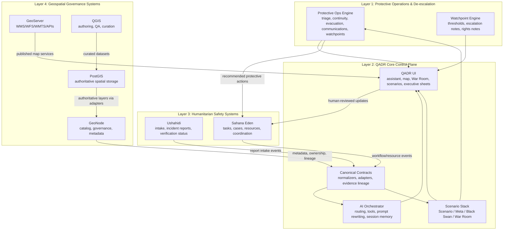

# QADR110 4-Layer Architecture Roadmap

> Safety baseline: for the corrected, approved scope, see [civil-protection-safe-rescope.md](./civil-protection-safe-rescope.md). This roadmap must be read as civil-protection, de-escalation, humanitarian-coordination, and rights-preserving decision support only.

## Executive Intent

QADR110 should remain the primary analyst workspace while expanding into a domain-neutral civil protection, crisis intelligence, and nonviolent strategic resilience platform. The platform must support early warning, de-escalation, humanitarian coordination, geospatial governance, and scenario reasoning without drifting into coercive, offensive, or rights-eroding functionality.

This roadmap extends the current QADR architecture rather than replacing it. QADR stays the control plane. External systems remain systems of record for their own domains. All integration should be API-first, event-driven, typed, auditable, and privacy-aware.

## Hard Boundaries

The platform must not implement:

- offensive military targeting
- target selection or target packages
- coercive crowd-control workflows
- repressive or biometric suppression workflows
- provider-safeguard bypasses
- operational attack plans
- unlawful surveillance abuse

If a request drifts toward coercive or violent functionality, the platform must redirect to lawful alternatives:

- early warning
- de-escalation
- evacuation and shelter planning
- service continuity
- rights-preserving public safety workflows
- humanitarian coordination
- verification and evidence handling
- citizen-impact assessment

## Architecture Principles

- QADR remains the main user-facing workspace.
- External systems remain authoritative within their own bounded contexts.
- No direct cross-database coupling across Ushahidi, Sahana, GeoNode, GeoServer, or PostGIS.
- Use adapters, normalizers, typed contracts, and reconciliation jobs.
- Preserve provenance, explainability, auditability, and human checkpoints.
- Recommendations must remain decision-support, not coercive execution.
- Every high-impact workflow must carry a rights-impact note.

## Current QADR Extension Points

The current repository already provides strong extension anchors:

- QADR workspace and shell: `src/App.ts`, `src/app/panel-layout.ts`, `src/config/panels.ts`, `src/components/*`
- Desktop runtime: `src-tauri/*`
- AI orchestration: `src/services/ai-orchestrator/*`, `server/worldmonitor/intelligence/v1/orchestrator.ts`, `server/worldmonitor/intelligence/v1/orchestrator-tools.ts`
- Scenario stack: `src/ai/scenario-engine.ts`, `src/ai/meta-scenario-engine.ts`, `src/ai/black-swan-engine.ts`, `src/ai/war-room/*`, `src/ai/strategic-foresight.ts`
- Prompt intelligence and map awareness: `src/services/PromptSuggestionEngine.ts`, `src/services/MapAwareAiBridge.ts`, `src/services/ScenarioMapOverlay.ts`
- Domain model foundation: `src/platform/domain/model.ts`, `src/platform/domain/ontology.ts`, `src/platform/domain/ids.ts`
- Adapter and interoperability layer: `src/platform/interoperability/*`, `src/platform/capabilities/*`
- Operations contracts: `src/platform/operations/*`

These extension points make QADR well-suited to become the control plane for the four-layer platform.

## Four-Layer Architecture

### Layer 1: Protective Operations & De-escalation

Purpose:

- early warning
- incident triage
- nonviolent response planning
- public communications
- evacuation routing
- shelter and resource prioritization
- service continuity
- rumor and narrative-risk monitoring
- civic-rights impact assessment

This layer must remain domain-neutral. It should model:

- Asset
- Zone
- Event
- Capability
- Risk
- Action
- Watchpoint

It must never model weapon-specific or repression-specific playbooks. Its outputs must be:

- protective actions
- continuity actions
- communication actions
- monitoring priorities
- escalation thresholds
- rights notes

Recommended placement:

- business logic inside QADR service modules and typed contracts
- outputs visualized in QADR map panels, assistant, War Room, and executive sheets
- operational actions generated as recommendations, not automated enforcement

### Layer 2: QADR Core

QADR Core remains the primary control plane and analyst workspace.

Keep inside QADR:

- frontend and Preact application shell
- Tauri desktop shell
- War Room UI
- assistant
- map UX
- session-aware prompt suggestions
- scenario visualization
- meta-scenario visualization
- Black Swan watch surfaces
- executive summaries
- evidence cards and drill-down sheets

This layer should own:

- analyst session context
- prompt routing
- orchestration
- evidence presentation
- scenario reasoning surfaces
- human review and explanation UX
- cross-system situational synthesis

### Layer 3: Humanitarian Safety

External systems:

- Ushahidi for intake and incident reporting
- Sahana Eden for crisis workflows, coordination, case handling, task routing, and aid/resource processes

Responsibilities:

- verification states for field reports
- privacy and minimization
- human review checkpoints
- de-escalation-first workflows
- citizen-protection metrics
- vulnerability overlays
- affected-population overlays
- resource distribution tracking
- humanitarian task orchestration

QADR must consume normalized outputs from this layer, but not replace the systems of record.

### Layer 4: Geospatial Governance

External systems:

- GeoNode for catalog, metadata, sharing, and governance
- GeoServer for standards-based publishing and interoperability
- PostGIS for authoritative spatial storage and indexing
- QGIS for authoring, QA, and curation

Responsibilities:

- provenance
- metadata completeness
- ownership
- permissions
- update cadence
- jurisdictional boundaries
- quality-control workflow
- auditability

QADR should consume published geospatial assets and governance metadata through typed adapters, not by directly managing GeoNode or QGIS authoring workflows inside the main app.

## Service-Boundary Diagram

## Domain-Neutral Canonical Schema

The existing QADR domain model in `src/platform/domain/*` should be extended, not replaced. The following normalized schema should become canonical across all adapters.

| Canonical object | Purpose | Key fields | Suggested system of record |
| --- | --- | --- | --- |
| Asset | Protected thing or service | id, labels, owner, location, capability refs, dependency refs | QADR canonical object, optionally hydrated from Sahana/GeoNode |
| Zone | Operational or jurisdictional area | id, geometry ref, jurisdiction, risk profile, service coverage | GeoNode/PostGIS via governance adapters |
| Event | Reported or inferred situation | id, kind, summary, severity, location, time, evidence refs | QADR canonical event |
| Capability | Available protective or humanitarian capacity | id, type, owner, readiness, constraints | Sahana/QADR |
| Risk | Structured risk statement | id, domain, likelihood, impact, drivers, rights notes | QADR canonical risk layer |
| Action | Recommended nonviolent action | id, type, decision horizon, dependencies, approvals, rights note | QADR canonical decision-support object |
| Watchpoint | Monitorable threshold or signal | id, indicator, threshold, cadence, escalation note | QADR watchpoint engine |
| Report | Raw or semi-structured intake report | id, source, status, privacy flags, geometry, reporter class | Ushahidi adapter |
| VerifiedEvent | Human-reviewed validated event | id, verification status, evidence set, confidence, reviewer trace | QADR or Ushahidi-verified projection |
| WorkflowTask | Humanitarian or continuity task | id, assignee, status, dependency, SLA, related event | Sahana adapter |
| Scenario | Plausible future state | id, title, assumptions, drivers, indicators, mitigations | QADR scenario engine |
| MetaScenario | Interaction of multiple scenarios | id, source scenarios, conflicts, dependencies, implications | QADR meta-scenario engine |
| Indicator | Measurable signal | id, type, current value, trend, freshness, source refs | QADR canonical indicator |
| EvidenceRef | Pointer to evidence and provenance | evidence id, source id, excerpt, weight, locator | QADR provenance layer |
| RightsImpactNote | Rights and civil-liberties note | id, workflow id, impact class, mitigation, reviewer | QADR governance layer |
| CivilianImpactEstimate | Structured civilian-impact projection | id, population, vulnerability groups, displacement/service impacts | QADR + Sahana derived object |
| ResourceAllocation | Allocation decision or state | id, resource type, quantity, zone, task, constraints | Sahana adapter |

## Data-Contract Matrix

| Contract family | Producer | Canonical landing zone | Consumer(s) | Sync mode |
| --- | --- | --- | --- | --- |
| IntakeReportContract | Ushahidi | Report / Event / EvidenceRef | QADR map, verification, assistant | event-driven + periodic reconciliation |
| VerificationStatusContract | Ushahidi + human review | Report / VerifiedEvent | QADR evidence cards, War Room, watchpoints | event-driven |
| HumanitarianTaskContract | Sahana Eden | WorkflowTask / Capability / ResourceAllocation | QADR protective layer, executive views | event-driven |
| ResourceStateContract | Sahana Eden | ResourceAllocation / Capability | QADR continuity views, map overlays | periodic + event-driven |
| LayerMetadataContract | GeoNode | Zone / metadata / ownership / cadence | QADR geospatial governance and map layer selection | scheduled sync |
| MapServiceContract | GeoServer | external service descriptor | QADR map UX, evidence overlays, assistant tools | runtime fetch + catalog sync |
| SpatialAuthorityContract | PostGIS via adapter | Zone / Asset / boundary refs | GeoServer, GeoNode, QADR analytics | scheduled ETL or CDC |
| QAChangeContract | QGIS workflow export | metadata update / geometry update proposal | PostGIS + GeoNode governance pipeline | human-approved publication |
| ScenarioContextContract | QADR | Scenario / Watchpoint / Risk | War Room, assistant, executive sheets | internal event bus |
| MetaScenarioContract | QADR | MetaScenario / conflict edges | War Room, Black Swan panel, foresight mode | internal event bus |
| BlackSwanContract | QADR | Black Swan candidate / monitoring state | watch surfaces, assistant, reports | internal event bus |
| RightsImpactContract | QADR + human review | RightsImpactNote | executive views, workflow gating, audit | required before approval for high-impact actions |

## Integration Matrix

| System or repository area | Layer(s) | Role | Integration pattern |
| --- | --- | --- | --- |
| QADR frontend (`src/App.ts`, `src/components/*`) | 2 | Primary analyst workspace | native |
| QADR desktop shell (`src-tauri/*`) | 2 | Desktop delivery, persistence, windowing | native |
| AI Orchestrator (`src/services/ai-orchestrator/*`, `server/worldmonitor/intelligence/v1/orchestrator.ts`) | 2, 1 | model routing, tool execution, human-in-the-loop orchestration | internal service |
| Scenario Engine (`src/ai/scenario-engine.ts`) | 2, 1 | competing futures, causal chains | internal service |
| Meta-Scenario Engine (`src/ai/meta-scenario-engine.ts`) | 2, 1 | scenario fusion and conflict | internal service |
| Black Swan Engine (`src/ai/black-swan-engine.ts`) | 2, 1 | low-probability, high-impact watch layer | internal service |
| War Room (`src/ai/war-room/*`, `src/components/WarRoomPanel.ts`) | 2, 1 | multi-agent strategic deliberation | internal service + UI |
| Prompt Suggestion Engine (`src/services/PromptSuggestionEngine.ts`) | 2, 1 | rights-preserving next prompts | internal service |
| Map-aware context (`src/services/MapAwareAiBridge.ts`, `src/platform/operations/map-context.ts`) | 2, 1, 4 | geospatial context injection | internal contract |
| Ushahidi | 3 | intake, incident reporting, public/field reports | adapter + normalizer |
| Sahana Eden | 3 | crisis workflows, tasks, case/resource tracking | adapter + normalizer |
| GeoNode | 4 | catalog, metadata, access, governance | adapter + catalog sync |
| GeoServer | 4 | interoperable map services | service descriptor + client connector |
| PostGIS | 4 | authoritative spatial storage | adapter + ETL/CDC |
| QGIS | 4 | authoring, QA, curation | publication/export workflow |
| Optional Mesa | 1, 2 | domain-neutral simulation | sidecar or batch adapter |
| Optional LangGraph.js | 2 | explicit orchestration graph and HITL flow | orchestration enhancement |
| Optional Qdrant | 2 | retrieval, memory, semantic linking | vector backend adapter |

## 4-Layer Operating Model

### Protective Outputs

The Protective Operations layer should produce only these actionable classes:

- protective action
- continuity action
- communication action
- monitoring priority
- escalation threshold
- rights note

Examples:

- stage a shelter-readiness review
- reroute civilian evacuation away from a flooded corridor
- prioritize repair crews for a water distribution dependency
- issue a public clarification notice for a rumor cluster
- raise the verification cadence on a report hotspot
- require human approval before publishing a high-impact status change

### Rights-Preserving Alternatives

If an analysis suggests coercive or repressive action, the platform should propose:

- de-escalation messaging
- public-information clarification
- service continuity measures
- shelter or evacuation support
- verification escalation
- humanitarian coordination
- civilian-impact review

## Step-by-Step Implementation Plan

### Phase 0: Repository Audit and Canonical Schema

Objectives:

- audit current QADR repository structure
- identify extension points
- define canonical schema

Actions:

1. Freeze the canonical QADR extension points in `src/platform`, `src/ai`, `src/services`, `src/components`, and `server/worldmonitor/intelligence/v1`.
2. Extend `src/platform/domain/model.ts` and `src/platform/domain/ontology.ts` to include the domain-neutral civil-protection objects listed above.
3. Add a new civil-protection contract bundle under `src/platform/operations/` for reports, verification, tasks, resource allocations, rights notes, and civilian-impact estimates.
4. Define adapter manifests for Ushahidi, Sahana Eden, GeoNode, GeoServer, PostGIS, and QGIS under `src/platform/capabilities/*`.

### Phase 1: Harden QADR Core

Objectives:

- harden QADR Core
- define War Room state and connectors
- add rights-preserving prompt suggestions

Actions:

1. Introduce a `rights-preserving` prompt family in `PromptSuggestionEngine`.
2. Add `RightsImpactNote` and `CivilianImpactEstimate` surfaces to the assistant, War Room, and executive summaries.
3. Add approval-state hooks for high-impact protective recommendations.
4. Ensure the map-aware assistant can always emit de-escalation-first alternatives.

### Phase 2: Integrate Ushahidi Intake and Verification

Objectives:

- integrate Ushahidi intake and verification adapters
- normalize reports into QADR domain objects

Actions:

1. Build `ushahidi-intake-adapter` and `ushahidi-verification-adapter` under `src/platform/interoperability/`.
2. Normalize incoming reports into `Report`, `Event`, `EvidenceRef`, and provisional `Zone` references.
3. Add verification states: `unverified`, `triaged`, `corroborated`, `contested`, `closed`.
4. Surface report verification state in map overlays and evidence cards.
5. Add privacy minimization and redaction filters before QADR persistence.

### Phase 3: Integrate Sahana Eden Workflows and Resources

Objectives:

- integrate Sahana Eden workflow and resource adapters
- connect response tasks and civilian-impact tracking

Actions:

1. Build `sahana-workflow-adapter` and `sahana-resource-adapter`.
2. Normalize tasks, case states, aid/resource distribution, and continuity actions into `WorkflowTask`, `Capability`, and `ResourceAllocation`.
3. Add humanitarian task orchestration panels and overlays in QADR without making QADR the system of record.
4. Connect civilian-impact estimates to task routing and priority views.

### Phase 4: Integrate GeoNode, GeoServer, PostGIS, and QGIS

Objectives:

- integrate governance and authoritative spatial services
- implement metadata, provenance, boundaries, and ownership handling

Actions:

1. Build `geonode-catalog-adapter`, `geoserver-service-adapter`, and `postgis-boundary-adapter`.
2. Define a `LayerMetadataContract` with ownership, permissions, update cadence, jurisdiction, quality state, and provenance.
3. Treat QGIS as an authoring and QA workstation, not an embedded runtime dependency in QADR.
4. Add quality-control workflow states: `draft`, `review`, `approved`, `published`, `superseded`.

### Phase 5: Add Scenario / Meta-Scenario / Black Swan / Watchpoint Modules

Objectives:

- connect the scenario stack to humanitarian and geospatial layers
- keep the focus on defensive and humanitarian planning

Actions:

1. Extend scenario inputs with normalized reports, verified events, humanitarian tasks, and authoritative boundaries.
2. Add a `Watchpoint Engine` that turns signals into monitorable thresholds and escalation notes.
3. Ensure every scenario output includes nonviolent actions, rights notes, and civilian-impact estimates where relevant.
4. Feed outputs into assistant, map UI, War Room, and executive report sheets.

### Phase 6: Pilot and Evaluate

Objectives:

- pilot with tabletop, resilience, and civil-protection use cases only
- define evaluation metrics

Metrics:

- time to awareness
- verification quality
- de-escalation support
- decision traceability
- rights compliance
- humanitarian coordination quality

Pilot scope examples:

- flood response tabletop
- evacuation corridor stress test
- rumor escalation and public clarification drill
- service continuity stress exercise
- humanitarian intake-to-task reconciliation drill

## Phased Migration Plan

### Why extend instead of rewrite during each phase

| Phase | Extension strategy | Why not rewrite |
| --- | --- | --- |
| 0 | extend current domain and adapter contracts | the repository already has canonical models, panels, and scenario services |
| 1 | harden current QADR shell and prompts | rewriting would destroy user-facing continuity and desktop/web parity |
| 2 | add Ushahidi adapters beside existing interoperability registry | greenfield intake UI would duplicate mature external capability |
| 3 | add Sahana adapters and workflow surfaces | rebuilding humanitarian case management in QADR would be slower and riskier |
| 4 | add GeoNode/GeoServer/PostGIS/QGIS boundaries | QADR is not a replacement for geospatial governance tooling |
| 5 | reuse current scenario stack and map-aware AI | the core reasoning layers already exist and only need broader inputs |
| 6 | validate with pilots before deeper scope | rewrite-first would postpone value and increase governance risk |

## Risk Register

| Risk | Impact | Likelihood | Mitigation |
| --- | --- | --- | --- |
| Cross-system schema drift | High | Medium | typed contracts, adapter versioning, reconciliation jobs |
| Privacy leakage from intake reports | High | Medium | redaction, field-level minimization, RBAC, human review |
| Overreach into coercive workflows | High | Medium | policy gates, rights-impact notes, refusal/redirection logic |
| Direct database coupling to external systems | High | Medium | API-first adapters only, no shared writes |
| Duplicate task ownership between QADR and Sahana | Medium | Medium | Sahana remains workflow system of record |
| Poor metadata quality for spatial assets | High | Medium | GeoNode governance workflow and QA gate |
| Low trust in AI-generated recommendations | High | Medium | evidence cards, confidence notes, audit trail, human approval |
| Alert fatigue | Medium | High | watchpoint prioritization, severity tuning, operator controls |
| Reconciliation lag across systems | Medium | Medium | retry queues, dead-letter handling, sync health dashboards |
| Unclear jurisdiction boundaries | High | Low | authoritative boundary contracts from PostGIS/GeoNode only |

## Governance Checklist

- least privilege enforced per adapter and per role
- role-based access for intake, verification, humanitarian, governance, and analyst functions
- field-level PII minimization for reports and cases
- redaction support for exported or shared evidence
- immutable history for high-impact decisions where appropriate
- human approval checkpoints before publishing high-impact recommendations
- provenance required for all verified events and executive summaries
- rights-impact note required for high-impact workflows
- retention policy for sensitive data
- reconciliation logs and audit trails for all adapter sync jobs
- clear ownership of authoritative records by external systems of record

## Test Strategy

### Contract Tests

- adapter input/output schema validation
- versioned payload fixtures for Ushahidi, Sahana, GeoNode, GeoServer
- rights-impact note requirement for high-impact actions

### Unit Tests

- canonical schema transforms
- watchpoint threshold logic
- rights-preserving prompt generation
- de-escalation recommendation logic

### Integration Tests

- intake report -> normalized report -> verified event -> map overlay
- humanitarian task -> resource allocation -> executive summary
- GeoNode metadata -> map layer governance badge -> access decision
- scenario output -> War Room -> protective action sheet

### End-to-End Tests

- analyst selects a region and receives a rights-preserving foresight brief
- field report enters from Ushahidi and appears in verification workflow
- resource shortfall in Sahana updates QADR watchpoints and continuity actions
- layer governance metadata from GeoNode affects what can be published or shared

### Evaluation Tests

- time to awareness under simulated incident load
- verification precision and review throughput
- rights-compliance review quality
- humanitarian coordination traceability
- watchpoint accuracy and false-positive rate

## Implementation Guidance by Repository Area

### Recommended new modules

- `src/platform/operations/civil-protection-contracts.ts`
- `src/platform/operations/rights-impact.ts`
- `src/platform/interoperability/ushahidi-adapter.ts`
- `src/platform/interoperability/sahana-adapter.ts`
- `src/platform/interoperability/geonode-adapter.ts`
- `src/platform/interoperability/geoserver-adapter.ts`
- `src/platform/interoperability/postgis-adapter.ts`
- `src/services/watchpoint-engine.ts`
- `src/services/protective-operations.ts`
- `src/components/CivilProtectionPanel.ts`
- `src/components/HumanitarianCoordinationPanel.ts`
- `src/components/GeospatialGovernancePanel.ts`

### Recommended existing modules to extend

- `src/platform/domain/model.ts`
- `src/platform/domain/ontology.ts`
- `src/platform/interoperability/adapters.ts`
- `src/services/PromptSuggestionEngine.ts`
- `src/services/MapAwareAiBridge.ts`
- `src/ai/scenario-engine.ts`
- `src/ai/meta-scenario-engine.ts`
- `src/ai/black-swan-engine.ts`
- `src/ai/war-room/debate-engine.ts`
- `src/components/QadrAssistantPanel.ts`
- `src/components/WarRoomPanel.ts`
- `src/components/StrategicForesightPanel.ts`
- `src/app/panel-layout.ts`
- `server/worldmonitor/intelligence/v1/orchestrator-tools.ts`

## Repository Reference Appendix

### Current QADR references

- QADR README: [https://github.com/danialsamiei/qadr110/blob/main/README.md](https://github.com/danialsamiei/qadr110/blob/main/README.md)
- Changelog: [https://github.com/danialsamiei/qadr110/blob/main/CHANGELOG.md](https://github.com/danialsamiei/qadr110/blob/main/CHANGELOG.md)
- Foundation dossier: [https://github.com/danialsamiei/qadr110/blob/main/docs/qadr/foundation-implementation-dossier.md](https://github.com/danialsamiei/qadr110/blob/main/docs/qadr/foundation-implementation-dossier.md)
- AI fabric: [https://github.com/danialsamiei/qadr110/blob/main/docs/qadr/openrouter-ai-fabric.md](https://github.com/danialsamiei/qadr110/blob/main/docs/qadr/openrouter-ai-fabric.md)
- Interoperability foundation: [https://github.com/danialsamiei/qadr110/blob/main/docs/qadr/interoperability-foundation.md](https://github.com/danialsamiei/qadr110/blob/main/docs/qadr/interoperability-foundation.md)
- Map geo-analytic workspace: [https://github.com/danialsamiei/qadr110/blob/main/docs/qadr/map-geo-analytic-workspace.md](https://github.com/danialsamiei/qadr110/blob/main/docs/qadr/map-geo-analytic-workspace.md)
- Scenario engine: [https://github.com/danialsamiei/qadr110/blob/main/docs/qadr/scenario-engine.md](https://github.com/danialsamiei/qadr110/blob/main/docs/qadr/scenario-engine.md)
- Meta-scenario engine: [https://github.com/danialsamiei/qadr110/blob/main/docs/qadr/meta-scenario-engine.md](https://github.com/danialsamiei/qadr110/blob/main/docs/qadr/meta-scenario-engine.md)
- Black Swan engine: [https://github.com/danialsamiei/qadr110/blob/main/docs/qadr/black-swan-engine.md](https://github.com/danialsamiei/qadr110/blob/main/docs/qadr/black-swan-engine.md)
- War Room debate engine: [https://github.com/danialsamiei/qadr110/blob/main/docs/qadr/war-room-debate-engine.md](https://github.com/danialsamiei/qadr110/blob/main/docs/qadr/war-room-debate-engine.md)
- Strategic foresight mode: [https://github.com/danialsamiei/qadr110/blob/main/docs/qadr/strategic-foresight-mode.md](https://github.com/danialsamiei/qadr110/blob/main/docs/qadr/strategic-foresight-mode.md)

### Core repository files

- App shell: [https://github.com/danialsamiei/qadr110/blob/main/src/App.ts](https://github.com/danialsamiei/qadr110/blob/main/src/App.ts)
- Panel layout: [https://github.com/danialsamiei/qadr110/blob/main/src/app/panel-layout.ts](https://github.com/danialsamiei/qadr110/blob/main/src/app/panel-layout.ts)
- Panels registry: [https://github.com/danialsamiei/qadr110/blob/main/src/config/panels.ts](https://github.com/danialsamiei/qadr110/blob/main/src/config/panels.ts)
- Domain model: [https://github.com/danialsamiei/qadr110/blob/main/src/platform/domain/model.ts](https://github.com/danialsamiei/qadr110/blob/main/src/platform/domain/model.ts)
- Ontology bundle: [https://github.com/danialsamiei/qadr110/blob/main/src/platform/domain/ontology.ts](https://github.com/danialsamiei/qadr110/blob/main/src/platform/domain/ontology.ts)
- Interoperability adapters: [https://github.com/danialsamiei/qadr110/blob/main/src/platform/interoperability/adapters.ts](https://github.com/danialsamiei/qadr110/blob/main/src/platform/interoperability/adapters.ts)
- Orchestrator backend tools: [https://github.com/danialsamiei/qadr110/blob/main/server/worldmonitor/intelligence/v1/orchestrator-tools.ts](https://github.com/danialsamiei/qadr110/blob/main/server/worldmonitor/intelligence/v1/orchestrator-tools.ts)
- Assistant endpoint: [https://github.com/danialsamiei/qadr110/blob/main/server/worldmonitor/intelligence/v1/assistant.ts](https://github.com/danialsamiei/qadr110/blob/main/server/worldmonitor/intelligence/v1/assistant.ts)
- War Room panel: [https://github.com/danialsamiei/qadr110/blob/main/src/components/WarRoomPanel.ts](https://github.com/danialsamiei/qadr110/blob/main/src/components/WarRoomPanel.ts)
- Strategic foresight panel: [https://github.com/danialsamiei/qadr110/blob/main/src/components/StrategicForesightPanel.ts](https://github.com/danialsamiei/qadr110/blob/main/src/components/StrategicForesightPanel.ts)

## Why QADR Extension Is Preferable to a Full Rewrite

QADR already has the hardest parts of the analyst workspace in place: a mature map-centric shell, a Tauri desktop runtime, an AI orchestrator, scenario modules, evidence-aware UI, a typed interoperability foundation, and a growing governance model. Rewriting would discard proven user workflows, duplicate existing scenario and War Room logic, delay integration with external systems of record, and create avoidable migration risk.

Extending QADR is preferable because it:

- preserves the current analyst experience
- reuses existing explainability and evidence surfaces
- keeps desktop/web parity intact
- avoids rebuilding scenario, War Room, and prompt-intelligence foundations
- lets Ushahidi, Sahana, GeoNode, GeoServer, PostGIS, and QGIS stay authoritative in their own domains
- supports phased delivery and tabletop validation before broader rollout
- reduces governance, privacy, and operational risk compared with a greenfield rewrite
