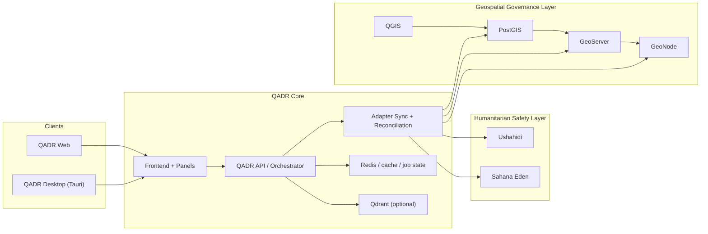

# QADR110 Incremental Implementation Plan

> Safety baseline: for the corrected, approved scope, see [civil-protection-safe-rescope.md](./civil-protection-safe-rescope.md). This implementation plan is limited to civil protection, nonviolent crisis response, humanitarian coordination, geospatial governance, domain-neutral scenario modeling, watchpoints, and rights-preserving decision support.

## Executive Summary

This plan turns the approved 4-layer architecture into a buildable sequence without rewriting QADR. QADR remains the primary frontend, desktop shell, War Room, assistant, map experience, scenario workbench, and executive briefing surface. External platforms remain systems of record within their own domains.

The implementation approach is:

1. strengthen QADR contracts and governance first
2. add adapters and normalized events second
3. layer humanitarian and geospatial integrations in bounded slices
4. connect the scenario stack only after reliable intake, workflow, and spatial governance foundations exist

This plan is deliberately constrained to civil protection, nonviolent crisis response, humanitarian coordination, spatial governance, and resilient decision support.

## Operating Constraints

The build must not introduce:

- offensive capability
- targeting workflows
- crowd-control repression
- bypasses of model or provider safeguards
- harmful surveillance patterns

Every high-impact recommendation must include:

- justification
- assumptions
- uncertainty
- civilian impact note
- rights impact note
- required human approvals

## Repository-by-Repository Integration Plan

### 1. QADR

Repository:

- [QADR](https://github.com/danialsamiei/qadr110)

Role:

- primary analyst control plane
- assistant, map, desktop, War Room, scenario and foresight UX
- canonical normalization boundary
- evidence, drill-down, executive summary, and rights-review surface

Implementation decision:

- do not move any user-facing workflow out of QADR
- extend `src/platform/*`, `src/services/*`, `src/ai/*`, `src/components/*`, and `server/worldmonitor/intelligence/v1/*`

### 2. Ushahidi

Repository:

- [Ushahidi Platform](https://github.com/ushahidi/platform)

Role:

- intake and incident reporting
- report lifecycle and verification projection into QADR
- public or field-facing intake, not analyst-facing synthesis

Integration boundary:

- adapter-only
- consume reports, categories, forms, media references, locations, status fields
- never couple directly to Ushahidi database tables

Planned sync method:

- initial pull sync
- scheduled incremental sync
- optional webhook receiver if available in deployment

### 3. Sahana Eden

Repository:

- [Sahana Eden](https://github.com/sahana/eden)

Role:

- crisis workflow, tasking, case/resource handling, coordination, and service continuity tracking

Integration boundary:

- adapter-only
- map task, case, resource, and status objects into QADR workflow objects
- Sahana remains the task and resource system of record

Planned sync method:

- API polling plus reconciliation
- explicit task-state mapping and approval-state projection into QADR

### 4. GeoNode

Repository:

- [GeoNode](https://github.com/GeoNode/geonode)

Role:

- geospatial catalog, metadata, governance, sharing, ownership, quality metadata

Integration boundary:

- ingest dataset and layer metadata only
- use GeoNode as the metadata and governance authority for spatial assets

Planned sync method:

- catalog index sync into QADR governance cache
- permission and metadata projection into map layer descriptors

### 5. GeoServer

Repository:

- [GeoServer](https://github.com/geoserver/geoserver)

Role:

- standards-based map publication
- WMS/WFS/WMTS style service exposure to QADR

Integration boundary:

- service descriptor ingestion and runtime consumption
- do not embed GeoServer authoring or administration into QADR

Planned sync method:

- service registration in QADR
- health checks and capabilities fetch
- runtime map/layer connection through controlled descriptors

### 6. PostGIS

Repositories:

- [PostGIS mirror](https://github.com/postgis/postgis)
- [PostGIS official source](https://gitea.osgeo.org/postgis/)

Role:

- authoritative spatial storage and indexing
- boundary and geometry authority beneath GeoServer and GeoNode

Integration boundary:

- QADR should access PostGIS through adapters or published services, not as a general-purpose shared application database

Planned sync method:

- authoritative geometry snapshots
- change-data extraction via scheduled ETL or controlled CDC

### 7. QGIS

Repository:

- [QGIS](https://github.com/qgis/QGIS)

Role:

- authoring, QA, geometry correction, styling preparation, and publication workflow staging

Integration boundary:

- offline/desktop authoring tool used by GIS stewards
- QADR consumes the published outputs, not the editing session itself

Planned sync method:

- publish curated layers to PostGIS and GeoServer
- sync metadata and publication state via GeoNode adapters

### Optional Components

- [LangGraph.js](https://github.com/langchain-ai/langgraphjs): optional orchestration graph runtime
- [Mesa](https://github.com/mesa/mesa): optional agent-based scenario simulation sidecar
- [Qdrant](https://github.com/qdrant/qdrant): optional retrieval and semantic linking backend

Use these only after the core adapters and governance path are stable.

## Service Decomposition Plan

### Proposed QADR Service Boundaries

### Existing core services to preserve

- `src/services/ai-orchestrator/*`
- `src/ai/scenario-engine.ts`
- `src/ai/meta-scenario-engine.ts`
- `src/ai/black-swan-engine.ts`
- `src/ai/war-room/*`
- `src/services/PromptSuggestionEngine.ts`
- `src/services/MapAwareAiBridge.ts`
- `src/platform/interoperability/*`
- `server/worldmonitor/intelligence/v1/orchestrator-tools.ts`

### New services to add

#### 1. `scenario-service`

Suggested placement:

- keep canonical logic in `src/ai/scenario-engine.ts`
- add orchestration-facing facade in `src/services/scenario-service.ts`

Responsibilities:

- scenario generation from normalized events, zones, capabilities, risks, and indicators
- causal chains
- ranking
- protective and humanitarian recommendations

#### 2. `meta-scenario-service`

Suggested placement:

- keep core logic in `src/ai/meta-scenario-engine.ts`
- add facade in `src/services/meta-scenario-service.ts`

Responsibilities:

- scenario fusion
- conflict edges
- dependency mapping
- competing-futures synthesis

#### 3. `black-swan-service`

Suggested placement:

- keep core logic in `src/ai/black-swan-engine.ts`
- add monitoring facade in `src/services/black-swan-service.ts`

Responsibilities:

- weak-signal and assumption-failure detection
- watchlist monitoring
- severity drift tracking

#### 4. `watchpoint-service`

Suggested placement:

- new files:
  - `src/services/watchpoint-engine.ts`
  - `src/platform/operations/watchpoint-contracts.ts`

Responsibilities:

- threshold evaluation
- escalation threshold mapping
- monitoring cadence
- rights-sensitive watch outputs for operators

#### 5. `rights-impact-service`

Suggested placement:

- new files:
  - `src/services/rights-impact-service.ts`
  - `src/platform/operations/rights-impact.ts`

Responsibilities:

- attach rights impact notes to high-impact recommendations
- flag required human approvals
- maintain justification, assumptions, uncertainty, civilian impact, and rights note bundle

#### 6. `integration-adapters`

Suggested placement:

- under `src/platform/interoperability/`
- one adapter file per external system

Suggested files:

- `src/platform/interoperability/ushahidi-adapter.ts`
- `src/platform/interoperability/sahana-adapter.ts`
- `src/platform/interoperability/geonode-adapter.ts`
- `src/platform/interoperability/geoserver-adapter.ts`
- `src/platform/interoperability/postgis-adapter.ts`
- `src/platform/interoperability/qgis-publication-adapter.ts`

### Shared internal support services

- `sync-service`: retry, reconciliation, dead-letter, last-sync state
- `audit-service`: immutable append-only audit envelopes for high-impact operations
- `privacy-service`: redaction and minimization before persistence or export
- `approval-service`: human checkpoint state machine

Suggested placement:

- `src/services/integration-sync.ts`
- `src/services/audit-log.ts`
- `src/services/privacy-redaction.ts`
- `src/services/approval-gates.ts`

## QADR File-by-File Extension Strategy

| File | Keep / Extend / Add | Change |
| --- | --- | --- |
| [src/App.ts](https://github.com/danialsamiei/qadr110/blob/main/src/App.ts) | Extend | bootstrap new civil-protection services, watchpoint engine, and adapter lifecycle |
| [src/app/panel-layout.ts](https://github.com/danialsamiei/qadr110/blob/main/src/app/panel-layout.ts) | Extend | register new panels for intake verification, humanitarian coordination, geospatial governance, and protective operations |
| [src/config/panels.ts](https://github.com/danialsamiei/qadr110/blob/main/src/config/panels.ts) | Extend | add panel definitions and defaults for civil-protection workstreams |
| [src/components/QadrAssistantPanel.ts](https://github.com/danialsamiei/qadr110/blob/main/src/components/QadrAssistantPanel.ts) | Extend | add rights-preserving prompt modes, humanitarian context cards, and approval-aware summaries |
| [src/components/WarRoomPanel.ts](https://github.com/danialsamiei/qadr110/blob/main/src/components/WarRoomPanel.ts) | Extend | surface normalized reports, workflow tasks, rights notes, and civilian-impact estimates in debate and executive views |
| [src/components/StrategicForesightPanel.ts](https://github.com/danialsamiei/qadr110/blob/main/src/components/StrategicForesightPanel.ts) | Extend | add protective outputs, humanitarian impacts, and rights-preserving recommendations |
| [src/components/MapContainer.ts](https://github.com/danialsamiei/qadr110/blob/main/src/components/MapContainer.ts) | Extend | support verified-report overlays, resource overlays, governance metadata overlays, and protected-zone layers |
| [src/components/MapAnalysisPanel.ts](https://github.com/danialsamiei/qadr110/blob/main/src/components/MapAnalysisPanel.ts) | Extend | add intake and protective workflow drill-downs |
| [src/services/PromptSuggestionEngine.ts](https://github.com/danialsamiei/qadr110/blob/main/src/services/PromptSuggestionEngine.ts) | Extend | add rights-preserving, de-escalation-first prompt families |
| [src/services/MapAwareAiBridge.ts](https://github.com/danialsamiei/qadr110/blob/main/src/services/MapAwareAiBridge.ts) | Extend | inject incident verification state, humanitarian overlays, and governance metadata into prompts |
| [src/platform/domain/model.ts](https://github.com/danialsamiei/qadr110/blob/main/src/platform/domain/model.ts) | Extend | add Asset, Zone, Capability, Risk, Action, Watchpoint, RightsImpactNote, CivilianImpactEstimate, ResourceAllocation |
| [src/platform/domain/ontology.ts](https://github.com/danialsamiei/qadr110/blob/main/src/platform/domain/ontology.ts) | Extend | include normalized report, verified event, workflow task, and resource records |
| [src/platform/interoperability/adapters.ts](https://github.com/danialsamiei/qadr110/blob/main/src/platform/interoperability/adapters.ts) | Extend | register Ushahidi, Sahana, GeoNode, GeoServer, PostGIS, and QGIS adapters |
| [src/platform/capabilities/catalog.ts](https://github.com/danialsamiei/qadr110/blob/main/src/platform/capabilities/catalog.ts) | Extend | add capability manifests and configuration requirements for all external systems |
| [src/platform/operations/map-context.ts](https://github.com/danialsamiei/qadr110/blob/main/src/platform/operations/map-context.ts) | Extend | carry verification, workflow, rights, and civilian-impact context |
| [src/services/ai-orchestrator/orchestrator.ts](https://github.com/danialsamiei/qadr110/blob/main/src/services/ai-orchestrator/orchestrator.ts) | Extend | route new adapter-backed tools and enforce approval-aware outputs |
| [server/worldmonitor/intelligence/v1/orchestrator-tools.ts](https://github.com/danialsamiei/qadr110/blob/main/server/worldmonitor/intelligence/v1/orchestrator-tools.ts) | Extend | expose tools for intake lookup, workflow lookup, governance lookup, watchpoint evaluation, and rights-note synthesis |
| `src/services/watchpoint-engine.ts` | Add | threshold logic and escalation calculations |
| `src/services/rights-impact-service.ts` | Add | rights-impact and civilian-impact note synthesis |
| `src/platform/operations/civil-protection-contracts.ts` | Add | canonical event and adapter payload contracts |
| `src/components/CivilProtectionPanel.ts` | Add | protective actions, continuity plans, and monitoring priorities |
| `src/components/HumanitarianCoordinationPanel.ts` | Add | task/resource/case awareness from Sahana |
| `src/components/GeospatialGovernancePanel.ts` | Add | metadata, ownership, quality, and publication state surface |

## API Contracts and Normalized Event Schemas

All external inputs should land in QADR as normalized canonical contracts.

### Ushahidi Adapter Contracts

#### Input from Ushahidi

Minimal raw entities to consume:

- posts or reports
- categories
- forms
- media attachments
- geolocation
- report status / verification state

#### QADR normalized output

```ts
interface IntakeReportEvent {
  eventId: string;
  sourceSystem: 'ushahidi';
  sourceRecordId: string;
  occurredAt: string;
  receivedAt: string;
  report: {
    id: string;
    title: string;
    description: string;
    language?: string;
    privacyFlags: string[];
    verificationState: 'unverified' | 'triaged' | 'corroborated' | 'contested' | 'closed';
    trustScore: number;
    duplicateOf?: string;
  };
  affectedZone: {
    zoneId?: string;
    geometry?: GeoJSON.Geometry;
    adminRefs?: string[];
  };
  source: {
    sourceId: string;
    sourceType: 'citizen' | 'ngo' | 'field-team' | 'public-feed' | 'unknown';
    sourceLabel?: string;
  };
  evidenceRefs: Array<{
    evidenceId: string;
    mediaType?: string;
    url?: string;
    hash?: string;
  }>;
  citizenImpact: {
    impactedPopulationEstimate?: number;
    vulnerableGroups?: string[];
    serviceDisruptions?: string[];
  };
  watchpoints: Array<{
    id: string;
    indicator: string;
    threshold: string;
  }>;
}
```

#### Ushahidi ingestion flow

1. fetch new or changed reports
2. map source identifiers and timestamps
3. deduplicate by source id, spatial proximity, time window, and content similarity
4. assign initial trust score
5. redact or minimize PII
6. store normalized report envelope
7. require manual verification for promotion to `VerifiedEvent`

#### Deduplication and trust scoring

Dedup dimensions:

- same source record id
- same geometry within configurable radius
- same time window
- same title/summary similarity
- same media hash

Trust score inputs:

- source class
- media/evidence presence
- corroboration count
- geography precision
- conflicting evidence
- verification history

#### Privacy controls

- strip direct contact data unless explicitly needed by authorized roles
- store reporter identity separately from general analyst views
- surface redacted evidence by default

### Sahana Eden Adapter Contracts

#### Input from Sahana

Minimal raw entities to consume:

- tasks
- cases
- incidents
- resources
- requests
- organizations / assignees
- status and workflow transitions

#### QADR normalized output

```ts
interface HumanitarianWorkflowEvent {
  eventId: string;
  sourceSystem: 'sahana-eden';
  sourceRecordId: string;
  occurredAt: string;
  workflowTask: {
    id: string;
    title: string;
    state: 'new' | 'assigned' | 'in-progress' | 'blocked' | 'complete' | 'cancelled';
    priority?: 'low' | 'medium' | 'high' | 'critical';
    ownerOrgId?: string;
    assigneeId?: string;
  };
  responseAction: {
    id: string;
    actionType: 'protective' | 'continuity' | 'coordination' | 'resource' | 'communications';
    approvalState: 'draft' | 'pending-human-approval' | 'approved' | 'rejected' | 'executed';
  };
  resourceRequest?: {
    id: string;
    resourceType: string;
    quantity?: number;
    status: 'open' | 'matched' | 'partially-filled' | 'fulfilled' | 'blocked';
  };
  coordinationStatus?: {
    status: 'green' | 'watch' | 'strained' | 'critical';
    blockingIssues: string[];
  };
  serviceContinuityAction?: {
    id: string;
    serviceType: string;
    continuityStage: 'prepare' | 'stabilize' | 'recover';
  };
}
```

#### Task state mapping

Recommended mapping:

- Sahana new -> `new`
- assigned -> `assigned`
- active/open -> `in-progress`
- waiting/dependency hold -> `blocked`
- resolved/closed -> `complete`
- cancelled -> `cancelled`

#### Human approval checkpoints

Required before QADR promotes any high-impact recommendation into a visible recommended action bundle:

- protective relocation decision
- continuity prioritization that reduces service for another zone
- public communication with elevated social effect
- resource allocation with large civilian-impact implications

### Geospatial Governance Contracts

#### GeoNode metadata contract

```ts
interface LayerMetadataEnvelope {
  layerId: string;
  sourceSystem: 'geonode';
  title: string;
  abstract?: string;
  ownerId?: string;
  permissions: string[];
  keywords: string[];
  updateCadence?: string;
  jurisdictionRefs?: string[];
  lineage?: string;
  qualityState?: 'draft' | 'review' | 'approved' | 'published' | 'superseded';
  publishedServiceRefs: string[];
}
```

#### GeoServer service contract

```ts
interface MapServiceDescriptor {
  serviceId: string;
  sourceSystem: 'geoserver';
  layerId: string;
  serviceType: 'WMS' | 'WFS' | 'WMTS' | 'OGC-API';
  baseUrl: string;
  capabilitiesUrl: string;
  featureTypeName?: string;
  styleRefs?: string[];
  accessScope: 'public' | 'restricted';
}
```

#### PostGIS authoritative boundary contract

```ts
interface SpatialAuthorityRecord {
  geometryId: string;
  sourceSystem: 'postgis';
  geometryType: 'point' | 'polygon' | 'multipolygon' | 'line';
  srid: number;
  jurisdictionRefs: string[];
  effectiveFrom?: string;
  effectiveTo?: string;
  checksum?: string;
}
```

#### QGIS publication and QA contract

```ts
interface QgisPublicationEvent {
  publicationId: string;
  sourceSystem: 'qgis';
  layerId: string;
  changeType: 'geometry-update' | 'style-update' | 'metadata-update' | 'boundary-fix';
  qaStatus: 'draft' | 'reviewed' | 'approved' | 'rejected';
  reviewer?: string;
  publishedAt?: string;
}
```

### Scenario Stack Contracts

All scenario modules should use the same neutral object vocabulary:

- asset
- zone
- event
- capability
- risk
- action
- indicator
- watchpoint

Every scenario output must include:

- protective implications
- humanitarian implications
- resilience implications
- civilian impact note
- rights impact note

## Delivery Sequence With Milestones and Rollback Points

### Milestone Table

| Milestone | Scope | Dependencies | Exit criteria | Rollback point |
| --- | --- | --- | --- | --- |
| M0 Discovery | repo audit, contracts, extension map | none | approved canonical schema and adapter boundaries | no runtime change |
| M1 Foundation | domain extensions, rights-impact contracts, watchpoint contracts | M0 | type-safe contracts merged, no UI breakage | revert new contracts and feature flags |
| M2 QADR hardening | assistant, map, War Room, panel wiring, governance hooks | M1 | new panels compile, existing flows intact | disable new panels and orchestration hooks |
| M3 Ushahidi integration | intake adapter, normalization, verification UI | M1, M2 | reports visible in QADR with verification states | turn off adapter, keep normalized cache read-only |
| M4 Sahana integration | workflow/resource adapter, coordination UI | M1, M2 | tasks and resources projected into QADR | disable adapter and keep prior QADR-only task surfaces |
| M5 Geospatial governance | GeoNode/GeoServer/PostGIS/QGIS adapters | M1, M2 | governed layers visible with metadata and permissions | fall back to current internal layer config |
| M6 Scenario rollout | scenario, meta, black swan, war room, watchpoints over normalized data | M3, M4, M5 | scenario outputs reference verified incidents, tasks, and governed zones | revert to current scenario inputs only |
| M7 Pilot and evaluation | tabletop, resilience and civil-protection pilots | M6 | metrics captured and governance checks passed | disable pilot-only connectors and reports |

## Phase-by-Phase Build Plan

### Discovery

Deliverables:

- canonical schema delta
- adapter boundary memo
- event schema approval
- feature flag plan

Rollback:

- none, documentation-only

### Foundation

Deliverables:

- `civil-protection-contracts.ts`
- `rights-impact.ts`
- `watchpoint-contracts.ts`
- adapter manifests

Rollback:

- remove new contracts and feature flags

### QADR Hardening

Deliverables:

- rights-preserving prompt suggestions
- new panels hidden behind feature flags
- approval-aware recommendation schema

Rollback:

- disable new panel registrations and orchestration tools

### Ushahidi Integration

Deliverables:

- intake adapter
- verification UI
- report dedup and trust scoring

Rollback:

- disable `ushahidi-intake-adapter`
- keep last normalized snapshots read-only

### Sahana Integration

Deliverables:

- workflow adapter
- resource/task map overlays
- coordination state panels

Rollback:

- disable `sahana-workflow-adapter`
- retain existing QADR-only analysis surfaces

### Geospatial Governance Integration

Deliverables:

- metadata sync
- service descriptors
- permissions and publication state overlays

Rollback:

- revert to current local layer registry
- preserve governance cache for diagnostics

### Scenario Stack Rollout

Deliverables:

- scenario stack over normalized civil-protection inputs
- watchpoint engine
- rights and civilian impact notes in outputs

Rollback:

- restrict scenario stack to current internal feeds only

### Pilot and Evaluation

Deliverables:

- tabletop runs
- metrics dashboards
- governance review report

Rollback:

- disable pilot connectors and revert to observation-only mode

## Testing Plan

### Contract Tests

Required:

- adapter payload parsing tests
- schema validation for all normalized envelopes
- rights-note presence test for high-impact recommendations
- approval-state requirement test for elevated actions

Suggested files:

- `tests/ushahidi-adapter.test.mts`
- `tests/sahana-adapter.test.mts`
- `tests/geonode-adapter.test.mts`
- `tests/geoserver-adapter.test.mts`
- `tests/postgis-adapter.test.mts`
- `tests/civil-protection-contracts.test.mts`

### Integration Tests

Required:

- report ingestion -> normalized report -> verified event
- task ingestion -> response action -> executive summary linkage
- layer metadata ingestion -> governed layer surface in map
- watchpoint emission -> assistant suggestion -> War Room note

Suggested files:

- `tests/intake-normalization-flow.test.mts`
- `tests/workflow-normalization-flow.test.mts`
- `tests/geospatial-governance-flow.test.mts`
- `tests/watchpoint-engine.test.mts`

### UI Tests

Required:

- QADR map drill-down from verified report
- assistant report card with rights and civilian impact notes
- War Room display of humanitarian and governance context
- panel-level feature flag fallback behavior

Suggested locations:

- `e2e/`
- `tests/qadr-civil-protection-ui.test.mts`

### Audit and Logging Tests

Required:

- audit record created for every high-impact recommendation
- reconciliation failures recorded and surfaced
- redaction applied before unauthorized views

Suggested files:

- `tests/audit-log.test.mts`
- `tests/privacy-redaction.test.mts`
- `tests/approval-gates.test.mts`

### Privacy and Access-Control Tests

Required:

- PII hidden from analyst roles without clearance
- restricted layers hidden when permission denied
- report source identity minimized in general workflows

### Scenario Simulation Smoke Tests

Required:

- scenario engine accepts normalized intake and workflow inputs
- meta-scenario layer reflects governed zones and verified events
- black swan layer handles sparse intake without fabricating confidence
- War Room remains rights-preserving under high-conflict scenarios

## Deployment Topology



### Recommended runtime topology

- QADR frontend and API together as the analyst control plane
- adapter sync workers as separate background jobs
- Redis for queues, reconciliation state, watchpoint state, and audit fan-out
- GeoServer and GeoNode deployed as separate geospatial services
- PostGIS deployed as the authoritative spatial database
- Ushahidi and Sahana deployed independently with their own governance and access control

### Network and access model

- QADR has read-mostly integration access to external systems
- write-back only where explicitly approved, logged, and necessary
- least privilege per connector
- service accounts separated by system and environment

## Dependencies, Risks, and Rollback Strategy

### Key dependencies

- approved canonical schema delta
- access to each external system’s API or export mechanism
- RBAC and service-account design
- audit log persistence
- feature flag infrastructure for staged rollout

### Key risks

- external API inconsistency
- over-coupling to humanitarian or GIS internals
- privacy leakage during intake normalization
- recommendation outputs that lack rights notes
- pilot complexity before foundational contracts stabilize

### Rollback strategy

For every integration:

- ship behind feature flags
- keep adapters read-only first
- preserve raw payload archive separately from normalized state
- keep previous QADR-only path as fallback until adapter quality is proven
- add reconciliation dashboards before enabling executive dependence on external signals

## Build First / Build Later / Avoid

### Build first

- canonical civil-protection contracts
- rights-impact service
- watchpoint engine
- adapter manifests and sync/reconciliation scaffolding
- Ushahidi normalized report flow
- Sahana task and resource projection
- GeoNode and GeoServer descriptor sync
- QADR assistant and War Room rights-preserving extensions

### Build later

- LangGraph.js orchestration replacement or augmentation
- Mesa-based simulation sidecar
- Qdrant-backed semantic linking for case memory
- advanced publication automation from QGIS into governed services
- deeper humanitarian case and beneficiary analytics

### Avoid

- rebuilding Ushahidi intake UX inside QADR
- rebuilding Sahana workflow/case management inside QADR
- direct cross-database joins between QADR and external systems
- embedding QGIS editing workflows into the main QADR runtime
- scenario outputs that resemble targeting or coercive action plans
- unreviewed publication of high-impact recommendations

## Source References

- [QADR](https://github.com/danialsamiei/qadr110)
- [Ushahidi Platform](https://github.com/ushahidi/platform)
- [Sahana Eden](https://github.com/sahana/eden)
- [GeoNode](https://github.com/GeoNode/geonode)
- [GeoServer](https://github.com/geoserver/geoserver)
- [PostGIS mirror](https://github.com/postgis/postgis)
- [PostGIS official source](https://gitea.osgeo.org/postgis/)
- [QGIS](https://github.com/qgis/QGIS)
- [LangGraph.js](https://github.com/langchain-ai/langgraphjs)
- [Mesa](https://github.com/mesa/mesa)
- [Qdrant](https://github.com/qdrant/qdrant)

## Evidence Notes

Repository descriptions and official documentation used to ground this plan:

- QADR repository structure and docs
- Ushahidi official documentation and repository
- Sahana Eden repository and public documentation hub
- GeoNode documentation for metadata and API usage
- GeoServer documentation for standards-based geospatial services
- PostGIS repository role as spatial extension to PostgreSQL
- QGIS repository role as GIS authoring and QA environment
