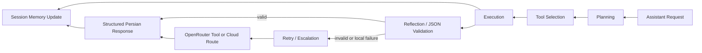

# Local-First AI Orchestrator

این سند لایه orchestrator جدید QADR110 را توضیح می‌دهد؛ لایه‌ای که روی همان مسیر موجود `assistant` و معماری فعلی Tauri/Preact/Vite/QADR panels سوار شده است.

## هدف

- local-first multi-model routing با fallback و escalation کنترل‌شده
- استفاده واقعی از ابزارها برای web/news/map/OSINT grounding
- بازنویسی پویا و session-aware پرامپت‌ها
- حفظ trace، evidence lineage، و تفکیک ساخت‌یافته واقعیت/تحلیل/سناریو/عدم‌قطعیت/توصیه

## فایل‌های اصلی

- `src/platform/ai/orchestrator-contracts.ts`
  - contractهای session, route, tool plan, node timeline
- `src/services/ai-orchestrator/gateway.ts`
  - route planning و provider-chain resolution
- `src/services/ai-orchestrator/prompt-strategy.ts`
  - intent inference, complexity scoring, tool planning, prompt composition
- `src/services/ai-orchestrator/session.ts`
  - session memory, intent evolution, map interaction history, reusable insights
- `src/services/ai-orchestrator/orchestrator.ts`
  - graph runner با nodeهای planning/tool-selection/execution/reflection/retry-escalation
- `server/worldmonitor/intelligence/v1/orchestrator-tools.ts`
  - ابزارهای واقعی server-side
- `server/worldmonitor/intelligence/v1/orchestrator.ts`
  - wiring بین graph و `callLlm`
- `server/worldmonitor/intelligence/v1/assistant.ts`
  - entrypoint نهایی که orchestrator را در مسیر فعلی assistant اجرا می‌کند

## Graph اجرا

## Routing policy

- `fast-local`
  - chain: `ollama -> custom -> browser -> vllm -> openrouter -> groq`
  - مناسب brief/summarization/extraction سبک
- `reasoning-local`
  - chain: `vllm -> custom -> ollama -> openrouter -> groq -> browser`
  - مناسب scenario/resilience/report/assistant
- `structured-json`
  - chain: `vllm -> custom -> ollama -> openrouter -> groq`
  - برای JSON schema-heavy taskها
- `cloud-escalation`
  - chain: `openrouter -> custom -> vllm -> ollama -> groq -> browser`
  - برای failure یا workloadهای پیچیده‌تر

## Tool interfaces

- `web_search(query)`
  - Google News RSS search
  - خروجی: packetهای خبر + source metadata
- `osint_fetch(source)`
  - GDELT + feed digest + Google Trends RSS
  - خروجی: packetهای OSINT و سیگنال‌های اخیر
- `map_context(lat/lon/zoom/bbox)`
  - خلاصه‌سازی MapContextEnvelope فعلی
  - خروجی: geo packet + prompt-ready narrative
- `prompt_optimizer(input)`
  - inject کردن session insights + map context + tool grounding
- `summarize_context(data)`
  - digest فشرده برای مراحل نهایی reasoning
- `openrouter_call(prompt)`
  - ابزار escalation در node `retry-escalation`

## Session awareness

برای هر thread اکنون این state ذخیره می‌شود:

- `intentHistory`
- `mapInteractions`
- `reusableInsights`
- `activeIntentSummary`

منابع به‌روزرسانی session:

- `QadrAssistantPanel`
- `map-analysis-workspace`
- `resilience/ai`

## Prompt strategy

پرامپت نهایی از این لایه‌ها ساخته می‌شود:

1. query کاربر
2. prompt pack موجود
3. map context
4. session history
5. tool-grounded context summary
6. optimized execution prompt
7. time context

## Failover logic

1. route محلی اولیه انتخاب می‌شود
2. اگر JSON معتبر برنگردد:
   - node `retry-escalation` فعال می‌شود
   - ابزار `openrouter_call` یا route ابری اجرا می‌شود
3. اگر باز هم JSON معتبر نباشد:
   - fallback evidence-first deterministic output برگردانده می‌شود

## Example flows

### 1. Geo analysis from map

- کاربر روی نقشه کلیک می‌کند
- `map-analysis-workspace` session و map interaction می‌سازد
- orchestrator ابزارهای `map_context`, `osint_fetch`, `summarize_context`, `prompt_optimizer` را اجرا می‌کند
- پاسخ ساخت‌یافته فارسی همراه با evidence cardها و trace بازمی‌گردد

### 2. Assistant follow-up with session reuse

- کاربر بعد از یک brief سؤال تکمیلی می‌پرسد
- `reusableInsights` در prompt تزریق می‌شوند
- اگر query پیچیده شود route از `fast-local` به `reasoning-local` یا `cloud-escalation` می‌رود

### 3. Resilience narration

- گزارش ساخت‌یافته تاب‌آوری به‌عنوان knowledge pack و pinned evidence به assistant داده می‌شود
- orchestrator context را فشرده می‌کند
- مدل محلی ترجیح داده می‌شود و فقط در صورت failure یا پیچیدگی بالا به cloud route می‌رود

## Environment hints

برای multi-model routing می‌توان این envها را ست کرد:

- `OLLAMA_FAST_MODEL`
- `OLLAMA_REASONING_MODEL`
- `OLLAMA_STRUCTURED_MODEL`
- `VLLM_FAST_MODEL`
- `VLLM_REASONING_MODEL`
- `VLLM_STRUCTURED_MODEL`
- `OPENROUTER_ESCALATION_MODEL`
- `OPENROUTER_STRUCTURED_MODEL`
- `LLM_FAST_MODEL`
- `LLM_REASONING_MODEL`
- `LLM_STRUCTURED_MODEL`

اگر این envها تنظیم نشوند، سیستم به `*_MODEL`های فعلی fallback می‌کند.
